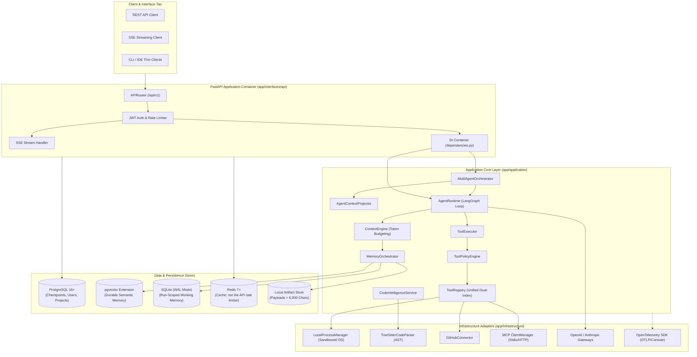

# High-Level Design (HLD) — ByteBuddhi Platform

> **Document Version:** 1.0.0  
> **Status:** Production-Grade Baseline  
> **Scope:**  (Core Runtime, Local Execution, Memory/Context/Artifacts, Code Intelligence, Connectors/MCP, Multi-Agent Orchestration, OpenTelemetry Observability, Web Research)

---

## 1. Executive Summary & Mission

**ByteBuddhi** is engineered as a production-grade AI coding and multi-agent execution platform. The core runtime provides deterministic control, durable state, hierarchical memory, sandboxed local process execution, semantic code intelligence, extensible Model Context Protocol (MCP) integrations, and enterprise-grade OpenTelemetry observability.

The design strictly follows **Hexagonal Architecture (Ports and Adapters)**, enforcing a total separation between pure enterprise domain logic, application use cases, and replaceable infrastructure technologies.

---

## 2. Core Architectural Tenets

1. **Never Assume**: Ground truth comes from verifiable process exit codes, database state, git status, and automated test assertions. The system treats natural language agent claims as unverified observations.
2. **One Unified Capability Model**: The agent runtime consumes a uniform capability abstraction (`ToolDefinition`, `ToolCall`, `ToolResult`). The agent does not differentiate whether a tool is backed by native Python code, a sandboxed OS shell command, a third-party REST connector (e.g. GitHub), or an external MCP server.
3. **Control Flow vs. Data Flow Separation**:
   - *Control Flow*: `LLM -> Decision -> Policy -> ToolExecutor -> OS / Connector`
   - *Data Flow*: `OS / API / Storage -> Observation -> State -> ContextEngine -> LLM`
4. **Single Shared AgentRuntime**: Specialized child agents (Researcher, Coder, Reviewer) and sub-agent delegations reuse the exact same `AgentRuntime` instance with scoped capabilities and context, avoiding duplicate loop implementations.
5. **Privacy & Redaction by Construction**: Telemetry, metrics, and traces are strictly isolated from sensitive data. Prompts, thought chains, credentials, and raw execution payloads never enter span attributes or metric labels.

---

## 3. C4 Architecture Level 2: Container Diagram

The system components and communication boundaries are illustrated below:



Canonical execution path:

```text
HTTP / future CLI / VS Code
    → authentication and HTTP validation
    → ExecuteTaskUseCase
    → trusted ExecutionContext
    → MultiAgentOrchestrator (when delegating) / AgentRuntime
    → ToolExecutor / ToolPolicyEngine
```

Authorization is application-owned (JWT + project ownership + workspace policy). PostgreSQL `auth.uid()` RLS is not wired and is not the isolation boundary.

Workspace modes: `local` for development/CLI user-selected roots; `managed` (required in production) confines `project.local_path` under `WORKSPACE_ROOT`.

---

## 4. Subsystem Architectural Breakdown

### 4.1 Core Agent Runtime
- **Engine**: State-node agent loop built as a state machine using LangGraph (`AgentLoopGraph`).
- **Context Generation**: Dynamically constructed per turn by `ContextEngine`. System prompts are pinned; conversation turns and execution history are token-budgeted.
- **Execution Lifecycle**: Manages iteration limits, cancellation tokens, token usage accumulation, and SSE streaming of reasoning events.

### 4.2 Local Execution Runtime & Sandboxing
- **Path Confinement**: All file reads/writes strictly resolve to normalized paths inside authorized workspace boundaries, eliminating directory traversal attacks (`../`).
- **Process Management**: `LocalProcessManager` executes OS subprocesses with real-time stream decoding, configurable timeouts, cancellation signals, and exit code capture.
- **Command Policy**: Evaluates command tokens against safety policies (Read-Only, Modifying, Network, Destructive) requiring explicit approvals.

### 4.3 Memory, Context & Artifact Storage 
- **Working Memory**: SQLite in WAL mode provides low-latency, run-scoped ephemeral state with short write transactions and automatic TTL expiration.
- **Durable Memory**: PostgreSQL with `pgvector` enables cross-session, semantic memory search ranked by relevance, recency, and importance.
- **Artifact Store**: Captures large tool payloads (> 6,000 characters) to disk, providing truncated summaries and content hashes to the LLM context to preserve token budgets.

### 4.4 Code Intelligence 
- **Tree-sitter Parsing**: Native incremental AST parsing for Python, JavaScript, and TypeScript.
- **Symbol Extraction**: Extracts functions, classes, methods, imports, and docstrings into structured domain chunks.
- **In-Memory Code Index**: Current API DI constructs a request-scoped empty `InMemoryCodeIndex`. It is discarded after the request and is not a durable per-project cache.

### 4.5 Connectors & Model Context Protocol (MCP) 
- **Unified Registry**: Maps native tools, third-party connectors (e.g. GitHub), and external MCP servers into a single dual-index capability registry (by name and standardized ID).
- **Security Boundaries**: External MCP servers are isolated behind trust allowlists; MCP schema attributes cannot override internal security risk classifications.
- **Credential Protection**: Secrets and API tokens are resolved strictly on the backend and masked; credentials are never passed into LLM prompt contexts.

### 4.6 Multi-Agent Runtime & Orchestration
- **DAG Task Scheduling**: Validates dependency graphs for cycles and missing dependencies, executing eligible tasks concurrently via an `asyncio.Semaphore`.
- **Atomic Global Budgeting**: Enforces thread-safe global token pool limits before child agent dispatch.
- **Cascading Cancellation**: Parent cancellation and global orchestration timeout stop remaining work. A critical child failure marks orchestration FAILED and skips dependents; independent siblings continue.
- **Trusted Approvals**: High-risk tools are authorized only from immutable `ExecutionContext.approved_actions`. Parent approvals are not inherited by children.
- **Context Projection**: `AgentContextProjector` filters parent transcripts, approval metadata, and credentials, projecting only minimal task context to child agents.

### 4.7 Observability & OpenTelemetry 
- **Application Ports**: Core layers depend solely on abstract `Tracer`, `Meter`, and `CorrelationContext` interfaces; OpenTelemetry SDK remains an infrastructure implementation detail.
- **Correlation Propagation**: Trace IDs, parent run IDs, child run IDs, and delegation depths propagate across async task trees using Python `contextvars`.
- **Privacy Enforcement**: Automated regex redaction masks API keys, bearer tokens, and private keys. Metric dimensions are filtered against low-cardinality allowlists to prevent memory leaks.
- **Defensive Telemetry Isolation**: Telemetry failures or exporter network dropouts are caught gracefully and never disrupt agent execution.

### 4.8 Web Research & Content Extraction
- **Capability path**: Agents invoke `web_research` through `ToolRegistry` → `ToolPolicyEngine` → `ToolExecutor` → `WebResearchService`. There is no runtime special case and no LangGraph-node search provider.
- **Ports**: Application-owned `WebSearchProvider`, `WebFetcher`, and `WebRenderer`. The first search adapter is a DuckDuckGo HTML client; it is not part of the application contract.
- **Safety**: Scheme allowlist, DNS/IP classification, per-redirect SSRF checks, streaming byte limits, bounded concurrency/timeouts, project-scoped `ArtifactStore` writes, and an explicit untrusted-content notice. See [Web Research](web_research.md).

---

## 5. Technology Stack Rationale

| Layer | Choice | Rationale |
|---|---|---|
| **Runtime Language** | **Python 3.13+** | AsyncIO performance, mature AI/ML ecosystem, modern typing support. |
| **Package Manager** | **uv** | Fast, deterministic dependency resolution, built-in virtual environment management. |
| **Framework** | **FastAPI** | Async-native, OpenAPI auto-generation, high-performance SSE streaming. |
| **Agent Graph** | **LangGraph** | Deterministic state transitions, cycle support, durable checkpointing. |
| **Parser** | **Tree-sitter** | High-speed, fault-tolerant incremental concrete syntax tree generation. |
| **Persistence** | **PostgreSQL + pgvector** | Robust relational ACID guarantees combined with native vector similarity indexing. |
| **Operational Store** | **SQLite (WAL)** | Zero-overhead, embedded, thread-safe operational store for ephemeral run memory. |
| **Caching** | **Redis** | Transient cache. API rate limiting is process-local in-memory per worker, not Redis-backed. |
| **Observability** | **OpenTelemetry** | Vendor-neutral industry standard for distributed tracing and semantic metrics. |
| **Linter & Formatter**| **Ruff** | Blazing-fast Rust-based static analysis replacing Flake8, Black, and isort. |

---

## 6. Non-Functional Requirements (NFR) Validation

- **Reliability**: Automated unit, integration, and security tests. Playwright Chromium tests skip when the browser extra is not installed.
- **Security**: Trusted `ExecutionContext` identity and approvals, managed workspace roots, command risk gating, application-layer authorization (not `auth.uid()` RLS), and bounded process output.
- **Concurrency**: Non-blocking async execution across tool calls, process streams, and child tasks.
- **Extensibility**: Clean hexagonal ports enable adding new connectors or MCP servers with zero changes to agent loop logic.
